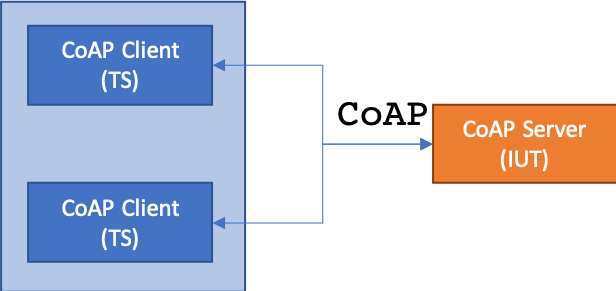

###############
CoAP Test Suite
###############

.. ###> Abbreviations for this document
.. |coap| replace:: :abbr:`CoAP (Constrained Application Protocol)`
.. |sut| replace:: :abbr:`SUT (System Under Test)`
.. |iut| replace:: :abbr:`IUT (Implementation Under Test)`
.. |ts| replace:: :abbr:`TS (Test System)`
.. |etsi| replace:: :abbr:`ETSI (European Telecommunications Standards Institute)`

.. contents::

-------------
CoAP Protocol
-------------

The |coap| protocol...

*TODO:* brief introduction to coap + references

-------------------
Test Configurations
-------------------
The concrete CoAP test configurations are listed below:

CoAP Test Configuration 01
==========================

.. image:: images/coap_conf_01.png
   :width: 350px
   :alt: CoAP Test Configuration 01
   :align: center

CoAP Test Configuration 02
==========================

CoAP Test Configuration 03
==========================

.. image:: images/coap_conf_03.png
   :width: 350px
   :alt: CoAP Test Configuration 03
   :align: center

CoAP Test Configuration 04
==========================

.. image:: images/coap_conf_04.png
   :width: 350px
   :alt: CoAP Test Configuration 04
   :align: center

-------------
Test Purposes
-------------
*TODO:* link to .tplan2 from GitHub and .pdf from |etsi|

-----------
Test System
-----------
*TODO: describe Test System* -> TTCN-3 code

----------
Test Cases
----------
You can find all CoAP Tests on GitHub.

.. literalinclude:: code_blocks/TC_COAP_SERVER_001.txt

-------------------
Test Case Functions
-------------------
*TODO:* describe a CoAP Test Case Function

.. literalinclude:: code_blocks/f_TC_COAP_SERVER_001.txt

----------------
Translation Port
----------------
*TODO:* Explain translation port

-----------------
Generic Functions
-----------------
*TODO:* describe MQTT_Functions module

--------------
Test Templates
--------------
*TODO:* describe templates

------------------
Default Behaviours
------------------
*TODO:* describe the default behaviours

.. seealso::

   `CoAP Plugtests 1: Guide <https://portal.etsi.org/cti/downloads/TestSpecifications/CoAP_IOT_TestSpecification_v016_20120321.pdf>`_
      ETSI CTI Plugtests Guide (First Draft V0.0.16 2012-03) for achieving interoperability

   `CoAP Plugtests 1: Report <https://portal.etsi.org/Portals/0/TBpages/CTI/Docs/CoAP_Plugtest_1_TR_2012.pdf>`_
      The 1st CoAP Plugtest was held from 24 to 25 March 2012 in Paris, France and was co-located with IETF#83.
      This event was jointly organized by ETSI, IPSO Alliance and the FP7 Probe-IT project1.
