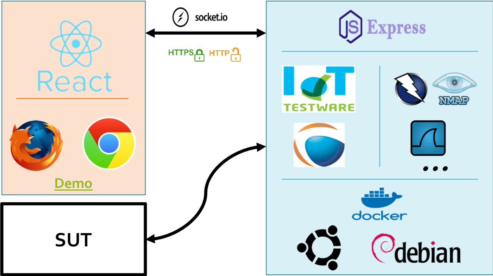
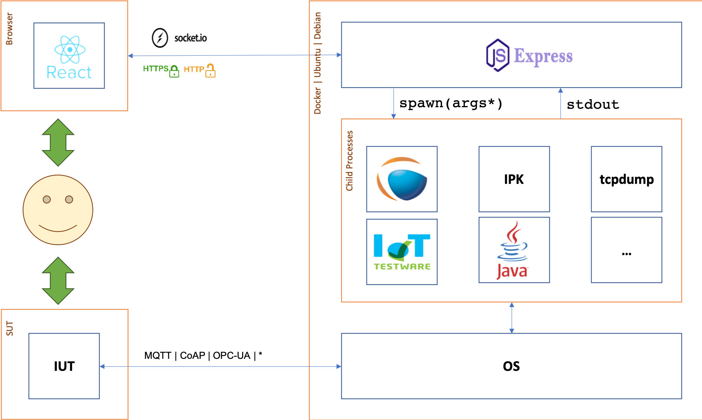
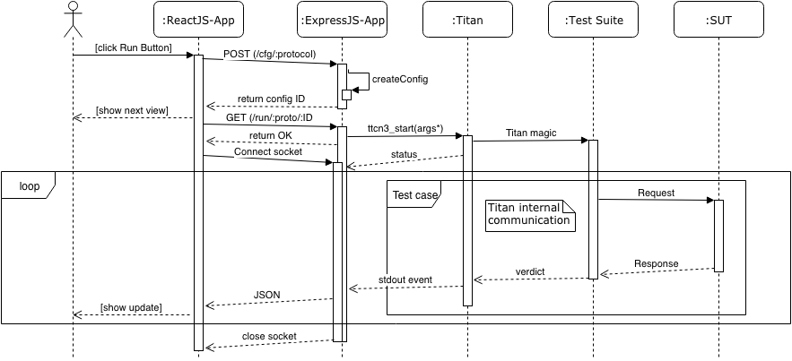

#########
Dashboard
#########

.. contents::

Introduction
============
The **Eclipse IoT-Testware Dashboard** is a collection of several tools and test suites which makes it extremely flexible and powerful.
Firstly the Backend_ which runs in background and provides the core functionality.
Secondly, the Frontend_, a thin ReactJS Application which provides a convenient user interface.
And last but not least, the `IoT-Testware <https://github.com/eclipse/iottestware>`_ with the test suites itself.

Overview
========
The first picture gives a brief overview about the basic idea.

Building upon the overview, the next picture is intended to give a more detailed view on the whole system. 

Backend
=======
The backend component is a node.js application which is intended to abstract the "low-level" handling of testing tools and their configurations.

Frontend
========
The frontend component is a JavaScript application which serves as a user interface to the backend component.
Through the nature of the architecture the frontend is intended to be a thin client.

Integration
===========
The sequence diagram below gives an overview about the interaction of involved components, starting from the user and ending with the SUT.

