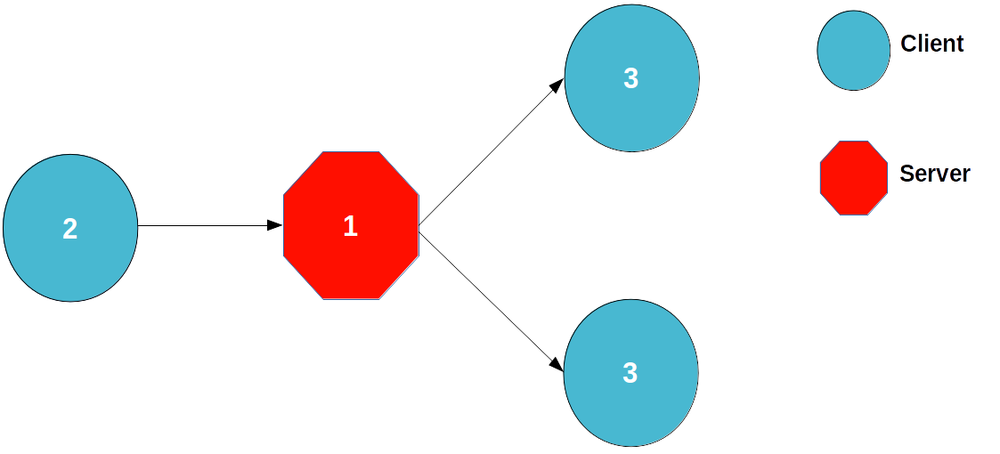
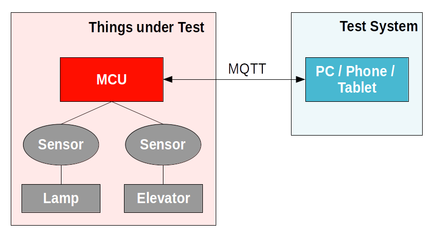
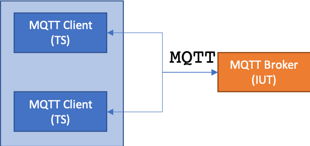

###############
MQTT Test Suite
###############

.. ###> Abbreviations for this document
.. |mqtt| replace:: :abbr:`MQTT (MQ Telemetry Transport)`
.. |sut| replace:: :abbr:`SUT (System Under Test)`
.. |iut| replace:: :abbr:`IUT (Implementation Under Test)`
.. |ts| replace:: :abbr:`TS (Test System)`
.. |tc| replace:: :abbr:`TC (Test Case)`
.. |tp| replace:: :abbr:`TP (Test Purpose)`
.. |ut| replace:: :abbr:`UT (Upper Tester)`
.. |etsi| replace:: :abbr:`ETSI (European Telecommunications Standards Institute)`

.. ###> Linked Conformance statements
.. |mqtt-1.5.3-1| raw:: html

   <a href="mqtt_spec.html#_[MQTT-1.5.3-1]">[MQTT-1.5.3-1]</a>

.. |mqtt-1.5.3-2| raw:: html

   <a href="mqtt_spec.html#_[MQTT-1.5.3-2]">[MQTT-1.5.3-2]</a>

.. contents::

-------------
MQTT Protocol
-------------
A very brief summary of |mqtt| from the `FAQ <http://mqtt.org/faq>`_
  MQTT stands for MQ Telemetry Transport. It is a publish/subscribe, extremely simple and lightweight messaging protocol, designed for constrained devices and low-bandwidth, high-latency or unreliable networks.

.. note:: We provide an :doc:`annotated version <./mqtt_spec>` of the official `MQTT specification <http://docs.oasis-open.org/mqtt/mqtt/v3.1.1/os/mqtt-v3.1.1-os.html>`_ which can be directly referenced (e.g. |mqtt-1.5.3-1| and |mqtt-1.5.3-2|)

-------------------
Test Configurations
-------------------
From a general and abstract perspective MQTT has two basic architectures for testing. This architecture directly reflects
the choice of your |sut|.
We will call the first architecture *Broker Testing*. A MQTT Broker is the |sut| as shown in the figure blow:

.. image:: images/gateway_testarchitecture.png
  :width: 300px
  :alt: Testing MQTT Brokers
  :align: center

The second major architecture we will call *Client Testing* as now, the Client is in focus as the |sut|.

Now we can start to extract different configurations from the test architectures.
The image below depicts the step of retrieving test configurations from the architecture:

.. image:: images/gateway_testarchitecture_MQTT_TS.png
   :width: 300px
   :alt: Testing MQTT Clients (Edge Devices)
   :align: center

The output of this exemplary step is a test configuration (``CF01``) where the Broker is the |sut| and the |ts| takes the role
of a MQTT Client.

The MQTT test suite uses four test configurations in order to cover the different test scenarios. In these configurations, the
tester simulates one or several MQTT clients or brokers implementing the MQTT protocol.

MQTT Test Configuration 01
==========================
The MQTT Broker is the |iut| and the |ts| takes the role of a MQTT Client

**ID**: MQTT_Conf_01

.. image:: images/mqtt_conf_01.png
   :width: 350px
   :alt: MQTT Test Configuration 01
   :align: center

MQTT Test Configuration 02
==========================
The MQTT Broker is the |iut| and the |ts| takes the role of multiple MQTT Clients.

**ID**: MQTT_Conf_02

MQTT Test Configuration 03
==========================
The MQTT Client is the |iut| and the |ts| takes the role of a MQTT Broker.
For this configuration an optional |ut| might be required.

**ID**: MQTT_Conf_03

.. image:: images/mqtt_conf_03.png
   :width: 350px
   :alt: MQTT Test Configuration 03
   :align: center

MQTT Test Configuration 04
==========================
As well the MQTT Broker as the MQTT Client, each is a |iut| in this configuration.
The part of the |ut| from the previous configuration is here replaced by a concrete application.

**ID**: MQTT_Conf_04

.. image:: images/mqtt_conf_04.png
   :width: 350px
   :alt: MQTT Test Configuration 04
   :align: center

-------------
Test Purposes
-------------

*TODO:* link to .tplan2 from GitHub and .pdf from |etsi|

-----------
Test System
-----------
*TODO: describe Test System* -> TTCN-3 code

----------
Test Cases
----------
You can find all MQTT Tests on GitHub.

We will examine the procedure of a single |tc| in order to get the understanding of the code structure.

The code block below shows the TTCN-3 implementation of the |tc| ``TC_MQTT_BROKER_CONNECT_01`` for the cohesive |tp|
``TP_MQTT_BROKER_CONNECT_01``

.. literalinclude:: code_blocks/TC_MQTT_BROKER_CONNECT_01.txt
   :linenos:

Let's have a deeper look into the details of a |tc|.
The first block comment contains only two `TTCN-3 documentation tags <https://www.etsi.org/deliver/etsi_es/201800_201899/20187310/04.05.01_60/es_20187310v040501p.pdf#page=9>`_
but these give us a direct connection between a |tc|, a |tp|, and the MQTT specification.

.. literalinclude:: code_blocks/TC_MQTT_BROKER_CONNECT_01.txt
   :lines: 1-5

The signature of a TTCN-3 |tc| contains many information which help us to reflect the Test Architecture.

.. literalinclude:: code_blocks/TC_MQTT_BROKER_CONNECT_01.txt
   :lines: 6

We have a distinct name for the |tc| which can be easy mapped to it's cohesive |tp|.
*(see in the MQTT |tp| catalogue for TP_MQTT_BROKER_CONNECT_001)*
The signature tells us also, that this |tc| will be executed on a Client (``runs on MQTT_Client``).

The body of the |tc| is used to initialize the test configuration and start the |tc| behaviour which is wrapped into a single function.

.. literalinclude:: code_blocks/TC_MQTT_BROKER_CONNECT_01.txt
   :lines: 8-12
   :emphasize-lines: 3

-------------------
Test Case Functions
-------------------
How does a |tc| function look like?

.. literalinclude:: code_blocks/f_TC_MQTT_BROKER_CONNECT_01.txt

While syntactically this function might appear confusing, though the semantic behind is quite powerful and simple.
Let's go through the implemented |tc| and the according |tp|.

----------------
Translation Port
----------------
*TODO:* Explain translation port

-----------------
Generic Functions
-----------------
*TODO:* describe MQTT_Functions module

--------------
Test Templates
--------------
*TODO:* describe templates

------------------
Default Behaviours
------------------
*TODO:* describe the default behaviours

.. seealso::

   `MQTT Interop Test Day in Burlingame, CA - March 17, 2014 <https://wiki.eclipse.org/Paho/MQTT_Interop_Testing_Day>`_
      The goal was to have as many different MQTT client and server implementations participate in interoperability testing to validate the implementation of the upcoming OASIS MQTT standard.

   `MQTT Interop Test Day in Ottawa, Canada – April 8, 2014 <https://www.eclipse.org/org/press-release/20140407_mqtt_test_day.php>`_
      MQTT Test Day Demonstrates Successful Interoperability for the Internet of Things

   `MQTT Interop Test Day in Burlingame, CA - March 9, 2015  <https://wiki.eclipse.org/Paho/MQTT_Interop_Testing_Day_2015>`_
      The goal was to have as many different MQTT client and server implementations participate in interoperability testing to validate the implementation of the OASIS MQTT 3.1.1 specification.
