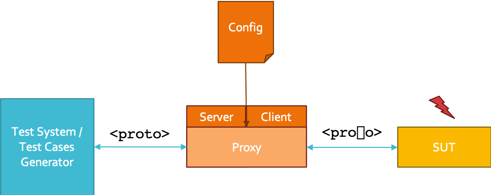
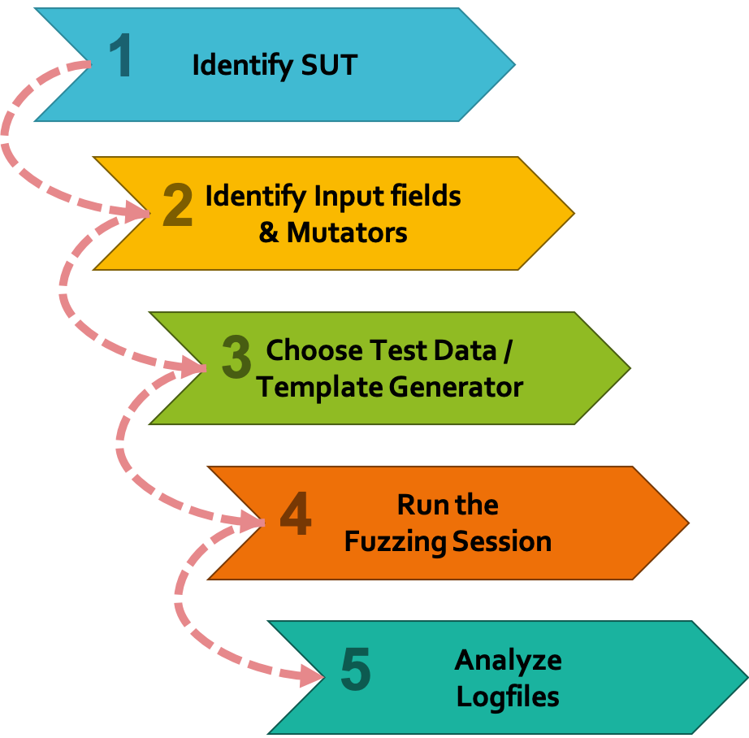

###################
Smart Fuzzing Proxy
###################

.. |PY_EXE_CMD_INLINE| replace:: ``python3 proxy.py``
.. |PY_EXE_CMD| replace:: python3 proxy.py

.. |EXE_CMD_INLINE| replace:: ``monkey``
.. |EXE_CMD| replace:: ./monkey
.. |EXE_NAME| replace:: Monkey
.. |VENV_DIR| replace:: ./venv

.. |TESTWARE_NAME| replace:: iottestware.fuzzing
.. |NICKNAME| replace:: Fuzzing Proxy

.. contents::

Installation
============

Prerequisite
------------
Make sure the following prerequisites are met.

* `Python <https://www.python.org/downloads/>`_ (at least version 3, 3.7 is recommended)
* `pip <https://pypi.org/project/pip/>`_
* python3-venv

Set-up a Virtual Environment
----------------------------
The |NICKNAME| requires a set of external libraries which must be installed beforehand.
To get you started as easy as possible, a helping |EXE_NAME| (based on the `Infinite monkey theorem <https://en.wikipedia.org/wiki/Infinite_monkey_theorem>`_)
is provided to assist you with your fuzzing endeavor.
Provided that your system meets the prerequisites, instruct the |EXE_NAME| to setup a virtual environment for you:

.. parsed-literal::

  |EXE_CMD| setup

This will create a Python virtual environment in |VENV_DIR| directory.

Manual Set-up of a Virtual Environment
--------------------------------------
The previously introduced Bash script provides an easy way to set up a virtual environment and installation
of all required dependencies. However, the script might fail or you just might want to set up the virtual environment on
your own. In this case the following steps will be required.

1. Create a virtual environment with ``python3 -m venv {VENV_DIRECTORY}``
2. Activate the virtual environment with ``source {VENV_DIRECTORY}/bin/activate``
3. Install ``pipenv`` for your virtual environment with ``pip install pipenv``
4. Install all required libraries with ``pipenv install``

   #. if installation fails with a ``FileNotFoundError`` probably ``pdflatex`` is missing as discussed on `GitHub <https://github.com/secdev/scapy/pull/2152>`_
   #. *Quickfix:* simply install LaTeX with e.g. ``apt install texlive-latex-base`` and repeat step 4

.. note::
  If you choose to create your {VENV_DIRECTORY} other than |VENV_DIR| the |EXE_NAME| won't be any longer able to find your virtual environment.
  To overcome this issue you will either need change the directory in the |EXE_CMD_INLINE| script or simply replace |EXE_CMD_INLINE| with |PY_EXE_CMD_INLINE|
  in the following examples.

Quickstart
----------
To start the |NICKNAME| against ``iot.eclipse.org:1883`` with a sample configuration execute the following command:

.. parsed-literal::

  |EXE_CMD| fuzzing -l 1883 -r iot.eclipse.org -c resources/samples/mqtt_01.json

This will start the |NICKNAME| which will proxy the MQTT traffic from your local machine to ``iot.eclipse.org``
and vice versa.

You can further explore the functionalities provided by the |NICKNAME| by using the built-in help.

.. parsed-literal::

  |EXE_CMD| --help
  |EXE_CMD| {command} --help

.. important:: Do not fuzz against production environments or systems other than your ones without permission.

General Concept
===============
The |NICKNAME| is a **MITM** (Man-in-the-middle) **Fuzzer** which is capable of proxying the network traffic between to systems and altering
this traffic on behalf of predefined rules. The |NICKNAME| does not generate any message on it's own.
To trigger the fuzzing you need to provide (more or less) valid templates.

In the next sections we will show you how to use the |NICKNAME| by applying a *5 Steps Fuzzing Workflow* as shown
in the following graphic.

Identify the SUT
================
Identifying the SUT (System Under Test) is the first step in the workflow.

.. note:: Needs to be further documented.

Identify Input fields
=====================
Identifying input fields and corresponding mutators for your fuzzing session is probably the most challenging part in the
whole workflow. In this section we will demonstrate how interesting input fields can be chosen and corresponding
mutators defined in the configuration file.

The configuration file provided to the |NICKNAME| contains abstract fuzzing instructions
which are used at runtime for manipulation of proxied messages.
This section will explain the basic concepts behind the configuration file and show you how to build a fuzzing scenario.

The configuration file is a plain JSON file following a specific schema.
Below each single configuration block is described in detail.

Protocol Module
---------------
First, we will start with the ``protocolModule`` block which simply defines some basic information about the fuzzed protocol.

.. code-block:: json

  {
    "protocolModule": {
      "protocol": "MQTT",
      "encoding": "utf-8",
      "payload": "json" }
  }

1. ``protocol`` obviously, defines which protocol will be used.
2. ``encoding`` defines how strings within the protocol fields should be handled.
3. ``payload`` defines how to handle payloads within messages. Currently, only ``json`` and ``raw`` are possible.

You can simply ask the |EXE_NAME| to tell you the supported protocols:

.. parsed-literal::

  |EXE_CMD| protocols

Protocol Message Examples
~~~~~~~~~~~~~~~~~~~~~~~~~
For the next steps we will require some insights into the protocol chosen in the protocol module.
Especially, the field namings and message structures provided by `Scapy <https://scapy.net/>`_
(which is used to decode and encode the messages) are required in the next steps.
To get familiar with Scapy's representation of protocol messages, you can use some provided message examples.

Again, simply ask the |EXE_NAME| to give you some examples for your chosen protocol:

.. parsed-literal::

  |EXE_CMD| samples mqtt

Fuzzdata Generators
-------------------
The |NICKNAME| is capable of using multiple fuzzdata generators. Currently, only a basic random generator is
implemented. However, the integration of different kinds of more sophisticated fuzz-data generators like `Fuzzino <https://github.com/fraunhoferfokus/Fuzzino>`_
might be implemented in the future.

.. code-block:: json

  {
    "generators": [
    { "id": "g_rand_uniform" },
    { "id": "g_rand_uniform_2" },
    { "id": "g_with_seed", "seed": 123 } ]
  }

For now, each basic generator requires only an unique ``id`` which we will use later on to reference the generators.
Additionallly, each generator can be initialised with a predefined ``seed`` for deterministic results.

.. note:: Generator IDs are enforced to start with ``g_``

Fuzzing Mutators
----------------
Now things start getting interesting. Fuzzing Mutators are one of the basic concepts of the |NICKNAME|.
The following block shows a set of different mutators, which will be explained in detail afterwards.

.. code-block:: json

  {
    "mutators": [
    { "id": "m_xor_protoname_fixed", "field": "protoname", "binary": "XOR", "hex": "0xA5A5" },
    { "id": "m_inc_protolevel", "field": "protolevel", "unary": "INCR" },
    { "id": "m_inc_clientid_len", "field": "clientIdlen", "unary": "INCR" },
    { "id": "m_replace_clientid", "field": "clientId",  "binary": "SET", "generator": "g_with_seed" },
    { "id": "m_replace_username", "field": "username",  "binary": "SET", "generator": "g_rand_uniform_2" },
    { "id": "m_invert_username_flag", "field": "usernameflag", "unary": "NOT" },
    { "id": "m_invert_flags_dup", "field": "DUP", "unary": "NOT" },
    { "id": "m_invert_flags_qos", "field": "QOS", "unary": "NOT" }]
  }

.. note:: Mutator IDs are enforced to start with ``m_``

Generally, each mutator requires an unique ``id`` and is always bound to a specific message ``field`` with
an operation. For now, two kinds of operations exist: ``unary`` and ``binary`` operations.

Unary Operators
~~~~~~~~~~~~~~~
Unary Operators, as the name implies, are unary with respect to the number of parameters which they expect.
An unary operator expects only one single parameter. It takes the value of the specified field (as the one and only parameter)
and applies a fuzzing operation on it.
The following example of an ``increment operator`` is an unary operation without any additional parameter:

.. code-block:: json

  { "id": "m_inc_protolevel", "field": "protolevel", "unary": "INCR" }

Or, if you want to think about the mutator in a more functional way:

.. code-block:: javascript

  function increment(value) => { return (value + 1) }

  protolevel := increment(protolevel)

The class of Unary Operators has the following concrete operators:

* ``INCR`` which simply increments the given value by one
* ``DECR`` which simply decrements the given value by one
* ``NOT`` which simply inverts the given value

Binary Operators
~~~~~~~~~~~~~~~~
Binary Operators on the other hand, take two parameters, the value of the specified field and either a fixed value
or a generator as the second parameter.
The following example of a ``xor operator`` is a binary operator with a fixed value:

.. code-block:: json

  { "id": "m_xor_protoname_fixed", "field": "protoname", "binary": "XOR", "hex": "0xA5A5" }

This mutator will take value of the field ``protoname`` and apply the ``XOR`` operator with a fixed hex value of ``0xA5A5``.
Or, if you want to think about the mutator in a more functional way:

.. code-block:: javascript

  function xor(value, mask) => { return (value ^ mask) }

  protoname := xor(protoname, 0xA5A5)

Additionally, Binary Operators can be also provided with generators which generate dynamically (random) values.
The following example of a ``set operator`` is a binary operator with a dynamically generated value:

.. code-block:: json

  { "id": "m_replace_clientid", "field": "clientId",  "binary": "SET", "generator": "g_with_seed" }

This mutator will take the value of the field ``clientId`` and appyl the ``SET`` operator with a dynamically generated
value generated by the generator with the ID ``g_with_seed``.
Or, if you want to think about the mutator in a more functional way:

.. code-block:: javascript

  function set(value, generator) => { return generator.rand(typeof(value)) }

  clientId := set(clientId, g_with_seed)

All Binary Operators can either be used with a fixed and predefined ``hex``-value or with a ``generator``.
The example below is also perfectly valid:

.. code-block:: json

  { "id": "m_replace_clientid", "field": "clientId",  "binary": "SET", "hex": "0xA5A5" }
  { "id": "m_xor_protoname_fixed", "field": "protoname", "binary": "XOR", "generator": "g_with_seed" }

In a functional representation, these would look as follows:

.. code-block:: javascript

  function set(field, hex_mask) => { return hex_mask) }
  function xor(field, generator) => { return (field ^ generator.rand(typeof(field)) }

  clientId := set(clientId, 0xA5A5)
  protoname := xor(protoname, g_with_seed)

The class of Binary Operators has the following concrete operators:

* ``XOR`` which applies an **xor** operation with the given second parameter on the given value
* ``AND`` which applies an **and** operation with the given second parameter on the given value
* ``OR`` which applies an **or** operation with the given second parameter on the given value
* ``SET`` which applies an **set** operation with the given second parameter on the given value

Filters
-------
After mutators, filters are the second building blocks on the path of building fuzzing rules.
These fuzzing filters are conceptually very similar to `Wireshark's DisplayFilters <https://wiki.wireshark.org/DisplayFilters>`_
and serve pretty much the same purpose.
As one might want to intercept more complex protocol behaviours, altering each single message would be a bad idea.
The concept of filters allows the user to pick only specific messages for fuzzing, while other message not matching
any filter are simply passed through without being fuzzed.
The given example below contains two filters which will be explained in more detail afterwards:

.. code-block:: json

  {
    "filters": [
    {
      "id": "f_all_connect",
      "description": "This filter matches all connect packets",
      "direction": "Request",
      "filter": { "field": "type", "op": "-eq", "value": 1 }
    }, {
      "id": "f_publish_subscribe",
      "descritpion": "Matches all publish or subscribe or unsubscribe packets",
      "direction": "All",
      "left": {
        "left": { "filter": { "field": "type", "op": "-eq", "value": 3 } },
        "op": "OR",
        "right": { "filter": { "field": "type", "op": "-eq", "value": 8 } } },
      "op": "OR",
      "right": { "filter": { "field": "type", "op": "-eq", "value": 10 } }
    } ]
  }

.. note:: Filter IDs are enforced to start with ``f_``

The first filter with the ID ``f_all_connect`` is a quite simple one and more or less self explanatory.
However, the filter demonstrates the basic concept. While ``id`` and ``description`` are quite obvious, the
``direction`` and ``filter`` fields require a little more explanation.

Filter Direction
~~~~~~~~~~~~~~~~
The ``direction`` field defines the direction of the filter. Valid directions are ``Request``, ``Response`` and ``All``.
Filters with ``"direction": "Request"`` will be only applied on messages passing through the |NICKNAME| from the client to the server.
On the other hand, filters with ``"direction": "Response"`` will only look for responses coming from the server.
And obviously, ``"direction": "All"`` will look for both directions.

Filter Definition
~~~~~~~~~~~~~~~~~
The filter field is actually the part which defines the filtering criteria. The following example filter
matches all packets of the ``type = 1`` (the `CONNECT Control Packet <http://docs.oasis-open.org/mqtt/mqtt/v3.1.1/os/mqtt-v3.1.1-os.html#_Toc398718028>`_ in case of MQTT):

.. code-block:: json

  { "filter": { "field": "type", "op": "-eq", "value": 1 } }

Conceptually, this filter can be thought of as follows:

.. code-block::

  message.type == 1

But filters can be more complex and contain multiple filtering criteria as demonstrated by the filter with the ID ``f_publish_subscribe``:
This filter contains a combination of three simple filters.

.. code-block:: json

  {
    "left": {
      "left": { "filter": { "field": "type", "op": "-eq", "value": 3 } },
      "op": "OR",
      "right": { "filter": { "field": "type", "op": "-eq", "value": 8 } } },
    "op": "OR",
    "right": { "filter": { "field": "type", "op": "-eq", "value": 10 } }
  }

Conceptually, this filter can be thought of as follows:

.. code-block::

        left.left              left.right              right
  ((message.type == 3) | (message.type == 8)) | (message.type == 10)

As one can see, we have two types of operators (``op``) in filters.
The comparison operators are used within concrete ``filter`` definitions as shown below:

.. code-block::

                  comparison operator
                      |      |
  { "field": "type", "op": "-eq", "value": 1 }

Valid comparison operators are:

* ``-eq`` which stands for ``==``
* ``-ne`` which stands for ``!=``
* ``-gt`` which stands for ``>``
* ``-lt`` which stands for ``<``
* ``-ge`` which stands for ``>=``
* ``-le`` which stands for ``<=``

The logical operators, on the other hand, are used to combine multiple single filter logically.

.. code-block::

                            logical operator
                                |     |
  "left": { "filter": {...} }, "op": "OR", "right": { "filter": {...} }

Valid logical operators are: ``OR``, and ``AND``

Rules
-----
Finally, the Rules Engine can be build by combining mutators and filters to concrete fuzzing rules.
The given example below contains two rules which will be explained in more detail afterwards:

.. code-block:: json

  {
    "rules": [
    {
      "match": "f_all_connect",
      "mutators": [ "m_inc_clientid_len", "m_xor_protoname_fixed", "m_inc_protolevel" ]
    }, {
      "match": "f_publish_subscribe",
      "distribution": {
        "model": "multinomial",
        "seed": 12345,
        "nxp": 10
        "items": [
          { "strength": 11, "mutators": [ "m_invert_flags_retain", "m_inc_flags_qos", "m_or_topic" ] },
          { "strength": 12, "mutators": [ "m_invert_flags_retain", "m_xor_topic", "m_inc_pl_length" ] },
          { "strength": 13, "mutators": [ "m_inc_pl_length" ] },
          { "strength": 14, "mutators": [ ] }
        ] }
    } ]
  }

The first rule is a quite simple one and contains two fields. The ``match`` field references a matching filter
previously defined in `Filters`_ and a set of ``mutators`` previously defined in `Fuzzing Mutators`_.
You can think of the first rule as follows: *Once the matching filter with the ID* ``f_all_connect`` *matches
a message, apply all three given mutators with the IDs* ``m_inc_clientid_len``, ``m_xor_protoname_fixed`` *and* ``m_inc_protolevel`` *to this message.*

The second rule is a little more complex, though more flexible and powerful with regards to it's capabilities to
manipulate protocol messages. Once again, the ``match`` field references a matching filter. However, this time
the rule does not contain a simple fixed list of ``mutators`` but rather a ``distribution`` of several lists.
Let's have a closer look at the distribution block. The ``model`` field defines the kind of the distribution which
will be used to choose one of the ``items``. Currently, ``multinomial`` distribution is the only one possible.
(The concrete implementation uses the `numpy.random.multinomial <https://docs.scipy.org/doc/numpy-1.15.0/reference/generated/numpy.random.multinomial.html>`_
module.) The distribution can also be configured with a ``seed`` and ``nxp`` (Number of experiments). However,
these fields are optional and can be omitted.
The ``items`` list represents all the possibilities the distribution can choose from.
Each set of mutators within a distribution is not necessarily equally weighted. That means, you can favor
specific sets of mutators and disfavor others via the ``strength`` field. Thereby applies, the higher the strength,
the higher the probability to be chosen. In concrete, in the example above the distribution has four items with an overall strength of
:math:`11+12+13+14=50`. That means, the probability to get the empty list of mutators
(the last one, which in fact won't manipulate any fields at all) is :math:`p_4=\frac{14}{50}=0.28` whereas the probability to get
the first list is only :math:`p_1=\frac{11}{50}=0.22` and so on.

.. warning::
  The total number of rules/filters should be kept as small as possible. In worst case scenarios
  each single filter must be checked for each message. Therefore, messages which do not match any filter
  (or the last one) need to be checked agains each single filter.
  The filter mechanism has a :math:`O(n)` time complexity. This might lead to performance
  issues on large sets of filters.

.. note::
  The total number of items within a distribution has a :math:`O(1)` time complexity, which means, you can
  theoretically have as many items as you need without influencing the runtime performance.

Checking the configuration
--------------------------
A fuzzing configuration can be become quite complex and confusing which might lead to errors at runtime.
To ensure that your configuration is valid, the ``validate`` command comes handy.
Once you have finished your configuration, ask the |EXE_NAME| to validate your configuration:

.. parsed-literal::

  |EXE_CMD| validate {CONFIGURATION}

Where ``{CONFIGURATION}`` can be either a relative or absolute path to your configuration file.

Choose a Test Data Generator
============================
As testcase generator you can either use a simple client of your choice or use an according `IoT-Testware <https://projects.eclipse.org/projects/technology.iottestware/developer>`_
conformance test suite.

Running a Fuzzing Session
=========================
Once you have build and validated your configuration you are ready to start fuzzing.
The |NICKNAME| can help you to start the |NICKNAME|:

.. parsed-literal::

  |EXE_CMD| fuzzing -l {LISTEN_PORT} -r {REMOTE_ADDRESS} -c {CONFIGURATION}

Where ``{LISTEN_PORT}`` is the port on which the fuzzing proxy will listen for incoming requests and forward
to ``{REMOTE_ADDRESS}:{LISTEN_PORT}`` with considering the rules given in ``{CONFIGURATION}``.
The following sketch demonstrates the following fuzzing setup: ``0.0.0.0:{LISTEN_PORT} <-> {REMOTE_ADDRESS}:{LISTEN_PORT}``

If you need to further configure the ports and interfaces you can provide parameters as follows:

.. parsed-literal::

  |EXE_CMD| fuzzing -l {LOCAL_LISTEN_PORT} -r {REMOTE_ADDRESS} -p {REMOTE_LISTEN_PORT} -c {CONFIGURATION}

This will result in the following fuzzing setup: ``0.0.0.0:{LOCAL_LISTEN_PORT} <-> {REMOTE_ADDRESS}:{REMOTE_LISTEN_PORT}``

To stop the Fuzzing Proxy press ``Ctrl + C``

Analyzing Fuzzing Logging
=========================
Once you have finished a fuzzing session, you will find within the ``logs`` folder a newly created folder with
a timestamped naming e.g. ``20190822_13_38_24`` (which is in fact the datetime when the |NICKNAME| was started).
Inside of this folder you will find at least the two log files ``fuzzing_operations.log`` and ``proxy_traffic.log``
which can be used to analyze the fuzzing session.
In general, the ``proxy_traffic.log`` contains all events happened, mainly incoming and outgoing messages and network events.
On the other hand, the ``fuzzing_operations.log`` contains all events which were executed by the fuzzer during the reception
and the forwarding of each single messages.

Let's have a closer look at an exemplary log file of a MQTT session.
First we will look into the ``proxy_traffic.log`` and go through the snipped line by line:

.. code-block::

  13:38:28.517 [127.0.0.1:58636->Proxy]: connection made from Client=127.0.0.1:58636
  13:38:28.518 [127.0.0.1:58636->Proxy]: '101c00044d5154540402003c00104d5154545f46585f436c69656e745f32'O
  13:38:28.521 [192.168.56.101:1883->Proxy]: connection made to SUT=192.168.56.101:1883
  13:38:28.625 [Proxy->192.168.56.101:1883]: '1a1c00044d5154540402003c00104d5154545f46585f436c69656e745f32'O
  13:38:28.626 [Proxy<-192.168.56.101:1883]: SUT closed connection: SUT=192.168.56.101:1883

In line 1 we see a network event (TCP connection) coming from a client (``127.0.0.1:58636``) and on line 2
the client sent immediatelly a message over this connection. This message is a `MQTT Connect Control Packet <http://docs.oasis-open.org/mqtt/mqtt/v3.1.1/os/mqtt-v3.1.1-os.html#_Toc398718028>`_
triggered by the client to request a (MQTT) connection to the server. If you like to look into the MQTT message,
ask the |EXE_NAME| to decode the bytestream for you:

.. parsed-literal::

    |EXE_CMD| decode -p mqtt -o '101c00044d5154540402003c00104d5154545f46585f436c69656e745f32'O

So far so good, everything went fine so far and the fuzzer didn't intercept. In line 3 we can observe how the |NICKNAME|
proxies the original network event (TCP connection) to the SUT (``192.168.56.101:1883``) and forwards the original, though manipulated,
MQTT Connect Control Packet. Finally, the SUT reacts with an `error handling routine <http://docs.oasis-open.org/mqtt/mqtt/v3.1.1/os/mqtt-v3.1.1-os.html#_Toc398718110>`_
by simply closing the network connection due to a protocol violation.
So, what happend inside the |NICKNAME| and what was the reason for the protocol violation?
First, we might take a closer look at the incoming and outgoing MQTT packets:

.. code-block::

  13:38:28.518 [127.0.0.1:58636->Proxy]:     '101c00044d5154540402003c00104d5154545f46585f436c69656e745f32'O
  13:38:28.625 [Proxy->192.168.56.101:1883]: '1a1c00044d5154540402003c00104d5154545f46585f436c69656e745f32'O

Well, didn't change that much. Let's consult the ``fuzzing_operations.log`` to figure out what happened in between.
There we will find a line like the following one:

.. code-block::

  13:38:28.519 [f_all_connect.3]: [NOT(DUP)=0->1; NOT(QOS)=0->1]

First of all, we can acknowledge this fuzzing operation took place in between the reception and forwarding of the
MQTT packet by comparing the timestamps. Second, by following the ``[f_all_connect.3]`` hint, we can clearly traceback
to applied rule, matching filter and set of mutators.
And finally, with ``[NOT(DUP)=0->1; NOT(QOS)=0->1]`` we get a summary of the complete set of mutators applied to this message.

In the following code block we can see the corresponding rule and the marked item:

.. code-block:: json
  :emphasize-lines: 2,11

  {
    "match": "f_all_connect",
    "distribution": {
      "model": "multinomial",
      "seed": 3456,
      "nxp": 10,
      "items": [
        { "strength": 1, "mutators": [ "m_xor_protoname_fixed", "m_inc_protolevel" ] },
        { "strength": 12, "mutators": [ "m_replace_username", "m_invert_username_flag" ] },
        { "strength": 15, "mutators": [ "m_inc_clientid_len", "m_replace_clientid" ] },
        { "strength": 7, "mutators": [ "m_invert_flags_dup", "m_invert_flags_qos" ] },
        { "strength": 15, "mutators": [ ] }
      ] }
  }

By having this information, we can now even further precise the `protocol violation <http://docs.oasis-open.org/mqtt/mqtt/v3.1.1/os/mqtt-v3.1.1-os.html#_Toc398718022>`_.

However, it should be noted, that this example is not a perfect fuzzing example as the broker
responded perfectly conformant according to the specification without crashing or exposing any weaknesses.
But this simple example should only serve as an illustration of the capabilities of the fuzzer and
demonstrate the workflow.
