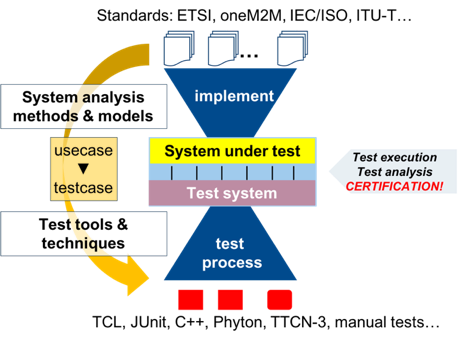

###########################
ETSI and Eclipse Foundation
###########################

Test projects currently cover MQTT, CoAP, Lo-RaWAN and foundational security IoT-Profile of IEC 62443-4-2. The work of `ETSI <https://www.etsi.org/>`_ `MTS-TST <https://portal.etsi.org/TBSiteMap/MTS/MTSTSTToR.aspx>`_ is correlated with the IoT-Testware which is hosted by the `Eclipse Foundation <https://www.eclipse.org/>`_. The technical contributions from the Eclipse members are coordinated by several dedicated Eclipse committers.
The work includes Test purposes in `TDL <https://tdl.etsi.org/>`_ (primarily `TDL-TO <https://www.etsi.org/deliver/etsi_es/203100_203199/20311904/01.03.01_60/es_20311904v010301p.pdf>`_ which is an extension of TDL for *Structured Test Objective Specification*) but also `TTCN-3 <http://www.ttcn-3.org/>`_ test code developments that is important for test campaign execution in the test labs.
In particular, ETSI members from MTS-TST control the test purposes developments and are responsible for the utilization of the resulting TP definitions for the ETSI working items and technical specifications. This approach allows to get input from active developers from the Eclipse community and a fast implementation of the target test suites for the interested industry but also support a faster develop-ment of ETSI specifications.

The illustrates an overview regarding two development procedures and its relationships: (a) the defini-tion and implementation of the target system (under test) that needs to address subjects, assets and require-ments as well as threats, policies and assumptions, and (b) the test development including test architecture, test purposes and test suite structure. System and test engi-neers need to derive the test implementation to be executed and analysed, e.g. for certification purposes.

